# Reward Scheme — Core Strategy Flowchart
**Full System Architecture & Upgraded Feature Map**
*Generated after 14-item enhancement plan — June 2026*

---

## 1. System Architecture Overview

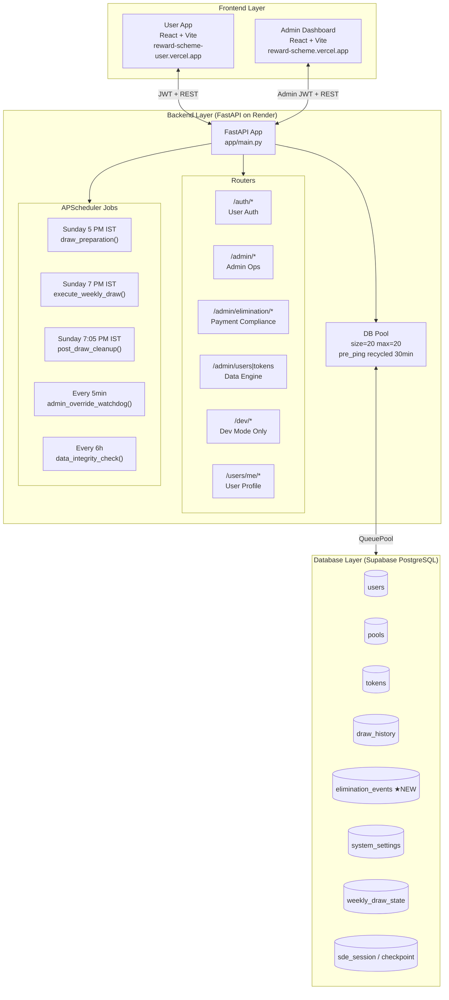

---

## 2. User Registration & Entry Flow

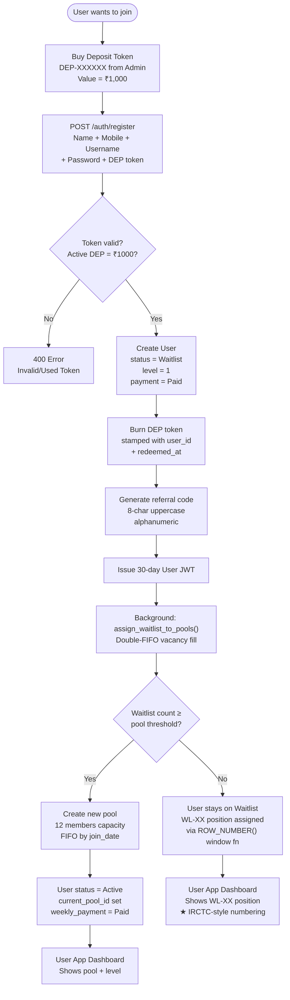

---

## 3. WL Queue Numbering System ★NEW

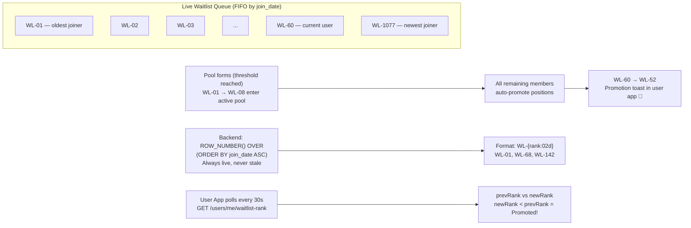

---

## 4. Pool Formation & FIFO Algorithm

```mermaid
flowchart TD
    TRIG(["Trigger: new user joins<br/>OR deposit redeemed<br/>OR admin force-fill"])
    TRIG --> FIFO["assign_waitlist_to_pools()<br/>Double-FIFO engine"]

    FIFO --> VAC{Any pool has<br/>vacancies?}
    VAC -- Yes --> FILL["Fill vacancies FIFO<br/>oldest waitlist users first<br/>level=1, payment=Paid"]
    VAC -- No --> THRESH

    THRESH{Paid waitlist count<br/>≥ threshold (default 8)?}
    THRESH -- Yes --> NEWPOOL["Create new 12-member pool<br/>pool_draw_type assigned<br/>contains_flagged_l4 = False"]
    THRESH -- No --> DONE([Wait for more users])

    FILL --> ACTIVE["User: Waitlist → Active<br/>current_pool_id assigned"]
    NEWPOOL --> FILL2["Fill pool with FIFO members"]
    FILL2 --> ACTIVE

    ACTIVE --> PAYCHECK{All 12 members<br/>weekly_payment = Paid?}
    PAYCHECK -- Yes --> ELIGIBLE["Pool eligible for draw"]
    PAYCHECK -- No --> UNPAID["Unpaid members accrued<br/>late_fees += ₹50/day<br/>POST /admin/penalty/apply-daily"]
```

---

## 5. Weekly Draw Lifecycle (Sunday Automated)

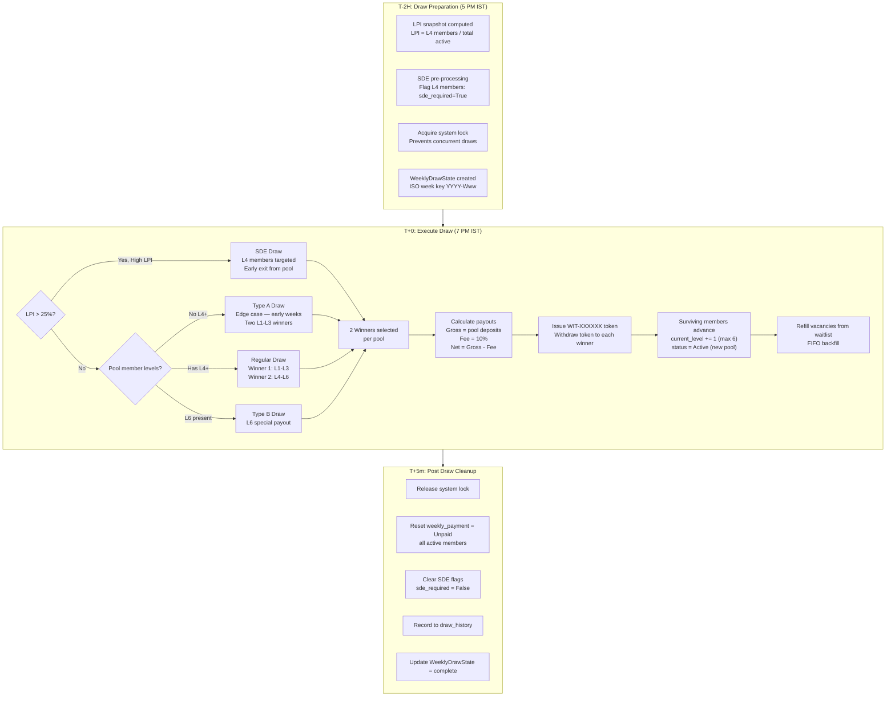

---

## 6. Payment, Late Fee & Elimination Engine ★NEW

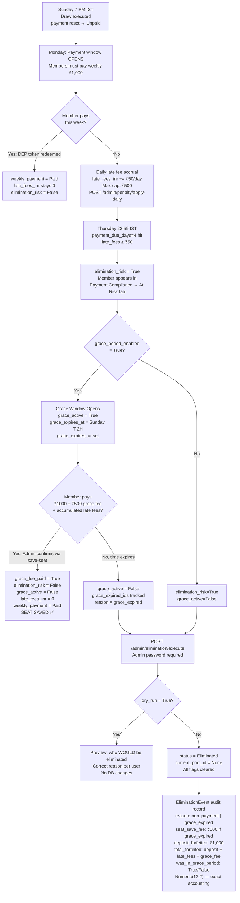

---

## 7. AI Risk Score & Payment Compliance Admin

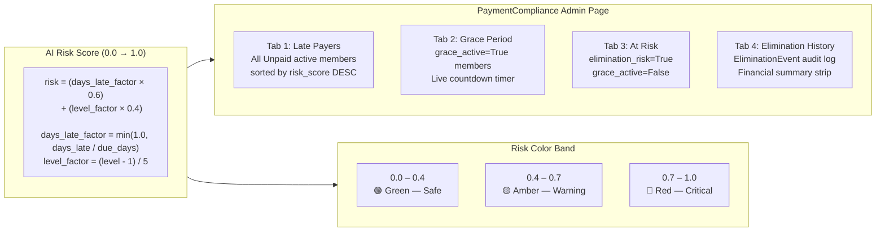

---

## 8. Data Integrity Auto-Repair Job ★NEW

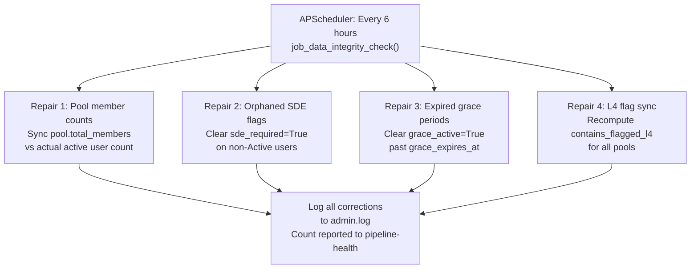

---

## 9. Simulation Engine (_AdvSimEngine) ★UPGRADED

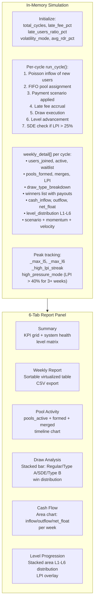

---

## 10. Full Token Lifecycle

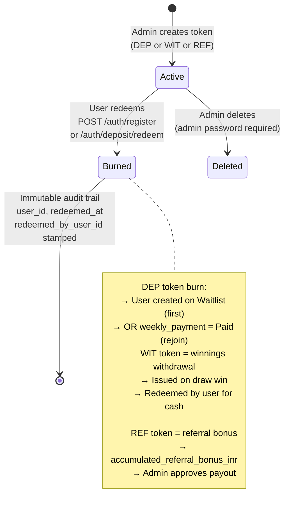

---

## 11. Admin Password 2FA Gate ★NEW

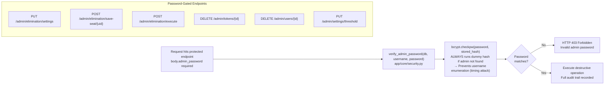

---

## 12. User App Notification System ★NEW

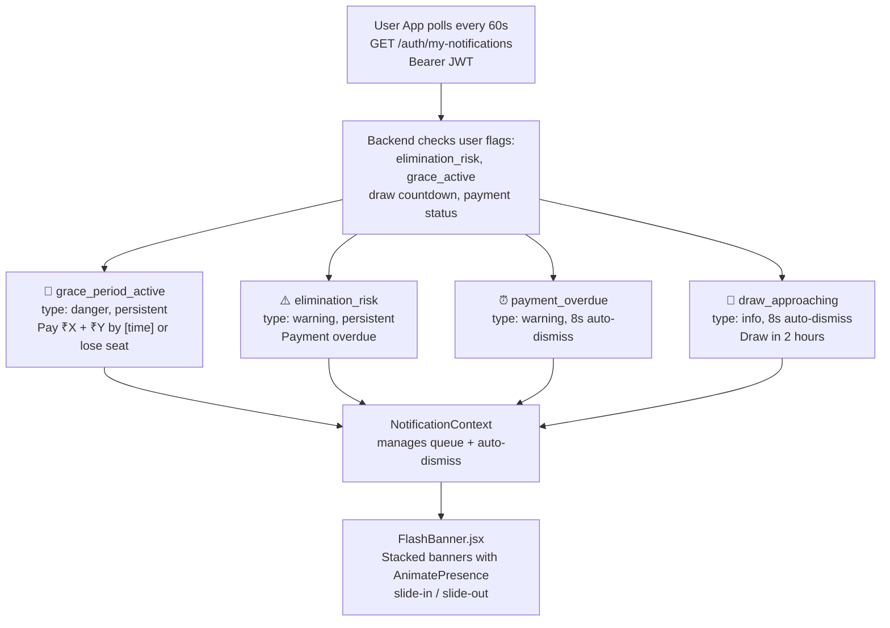

---

## 13. Deployment Architecture

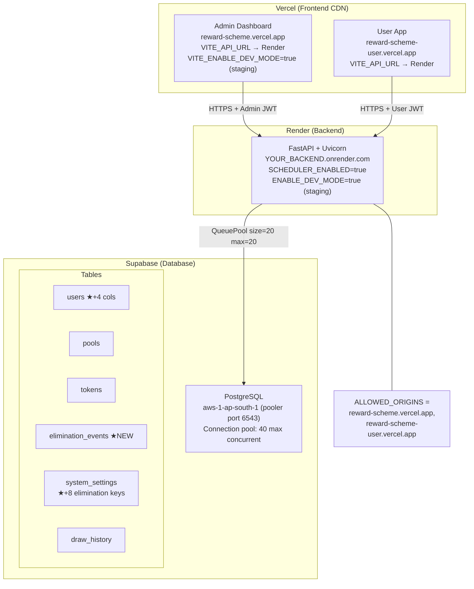

---

## 14. What Was Upgraded — Session Summary

| Phase | What Changed | Impact |
|---|---|---|
| **Phase 0** | DB pool size=20/max=20, inject-timed background tasks, UserDirectory pagination, health endpoints | Fixes all buttons failing after large injections |
| **Phase 1** | Full elimination engine, grace period flow, EliminationEvent audit table, 10 API endpoints, PaymentCompliance page, user-app flash notifications | Real payment enforcement with full financial audit trail |
| **Phase 2** | _AdvSimEngine L5/L6 tracking, 6-tab simulation report, consolidated late fee settings | Rich per-week simulation analytics with CSV export |
| **Phase 3** | Framer-motion animations across all 5 admin pages, LevelDistBar animation, WL promotion micro-toast | Smooth, professional UI feel |
| **Phase 4** | IRCTC-style WL-XX numbering via ROW_NUMBER() window fn, promotion detection in Dashboard | Clear real-time queue position for users |
| **Phase 5** | 6h data integrity APScheduler job, pipeline-health endpoint | Self-healing system, ops visibility |
| **Cross-Verification** | was_grace audit bug fixed (EliminationReason + seat_save_fee now correct), WinningLedger case-insensitive color, DevTools 479-line dead code removal | Accurate financial audit records |

---

## 15. One-Thing-You-Still-Need

```
⚠️  VITE_API_URL is still set to placeholder in both frontend .env files:
       admin-dashboard/.env  →  VITE_API_URL=https://YOUR_RENDER_BACKEND.onrender.com
       user-app/.env         →  VITE_API_URL=https://YOUR_RENDER_BACKEND.onrender.com

    Also fill in before going live:
       .env  →  USER_JWT_SECRET=<your 64-char hex>
       .env  →  ADMIN_JWT_SECRET=<your 64-char hex>
       .env  →  ADMIN_SETUP_SECRET=<your chosen secret>
    
    Generate secrets:
       python -c "import secrets; print(secrets.token_hex(32))"
```
